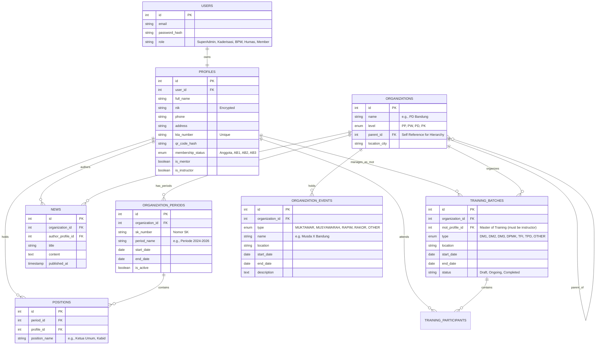

# **SPESIFIKASI KEBUTUHAN PERANGKAT LUNAK (SKPL)**
# **SOFTWARE REQUIREMENT SPECIFICATION (SRS)**

Nama Proyek: KAMMI.id v2.0  
Versi Dokumen: 1.0 (Revisi Formal)  
Tanggal: 25 Mei 2024  
Disiapkan Oleh: Tim Pengembang KAMMI.id

## **DAFTAR ISI**

1. [Pendahuluan](https://www.google.com/search?q=%231-pendahuluan)  
2. [Deskripsi Umum](https://www.google.com/search?q=%232-deskripsi-umum)  
3. [Kebutuhan Antarmuka Eksternal](https://www.google.com/search?q=%233-kebutuhan-antarmuka-eksternal)  
4. [Fitur Sistem (Kebutuhan Fungsional)](https://www.google.com/search?q=%234-fitur-sistem-kebutuhan-fungsional)  
5. [Kebutuhan Non-Fungsional](https://www.google.com/search?q=%235-kebutuhan-non-fungsional)  
6. [Lampiran Teknis](https://www.google.com/search?q=%236-lampiran-teknis)

## **1\. PENDAHULUAN**

### **1.1 Tujuan**

Dokumen ini disusun dengan tujuan untuk menetapkan spesifikasi kebutuhan perangkat lunak secara komprehensif bagi **Sistem Informasi Terpadu KAMMI**. Sistem ini dirancang sebagai repositori data terpusat (*Centralized Data Repository*) organisasi yang berfungsi untuk mengintegrasikan data keanggotaan (kader), struktur hierarki kepengurusan, validasi identitas anggota digital (KTA), serta sebagai platform publikasi informasi organisasi berskala nasional.

### **1.2 Ruang Lingkup (Scope)**

Perangkat lunak ini merupakan hasil rekayasa ulang (*re-engineering*) dari sistem terdahulu dengan pembaruan arsitektur yang signifikan. Ruang lingkup fungsionalitas aplikasi mencakup:

1. **Basis Data Kader Terpusat:** Sistem pengelolaan data pribadi, rekam jejak pelatihan (Daurah), dan partisipasi aktivitas organisasi seluruh kader di tingkat nasional.  
2. **Manajemen Struktur Organisasi:** Pengelolaan data kepengurusan yang berjenjang (PP, PW, PD, Komisariat) yang terintegrasi secara relasional dengan data kader.  
3. **KTA Digital (E-KTA):** Penerbitan Kartu Tanda Anggota digital yang dilengkapi dengan fitur verifikasi berbasis kode batang (*barcode*) dan fungsionalitas kartu nama digital.  
4. **Sistem Manajemen Konten (CMS):** Portal publikasi berita dan agenda kegiatan yang dikelola secara terdistribusi oleh masing-masing tingkat kepengurusan.  
5. **Sistem Manajemen Pembelajaran (LMS/Training):** Pengelolaan siklus pelaksanaan Dauroh (DM1, DM2, DM3, dst.) yang mencakup validasi peserta, verifikasi instruktur, dan pembaruan status keanggotaan secara otomatis.  
6. **Manajemen Kegiatan Organisasi:** Pencatatan dan pengelolaan agenda resmi organisasi (Musyawarah, Rapat Pimpinan, Rapat Koordinasi) yang dikelola oleh Pengurus Harian.

Perlu dicatat bahwa manajemen keuangan dan akuntansi organisasi tidak termasuk dalam ruang lingkup pengembangan pada fase ini.

### **1.3 Definisi, Akronim, dan Singkatan**

| Istilah/Akronim | Definisi |
| :---- | :---- |
| **PP** | Pengurus Pusat (Tingkat Nasional) |
| **PW** | Pengurus Wilayah (Tingkat Provinsi) |
| **PD** | Pengurus Daerah (Tingkat Kota/Kabupaten) |
| **PK** | Pengurus Komisariat (Tingkat Kampus) |
| **BPW** | Bidang Pengembangan Wilayah (Unit pengelola struktur wilayah) |
| **BPD/BPK** | Bidang Pengembangan Daerah/Komisariat (Unit pengelola struktur di bawahnya) |
| **DM** | Dauroh Marhalah (Jenjang Pengkaderan Utama) |
| **MoT** | *Master of Training* (Pimpinan sidang pelatihan) |
| **AB** | Anggota Biasa (Status keanggotaan berjenjang 1, 2, 3\) |
| **TFI** | *Training For Instructors* |
| **TPD** | *Training* Pengkaderan Daerah |
| **DPMK** | Dauroh Pemandu Madrasah KAMMI |
| **Muktamar** | Musyawarah tertinggi tingkat Nasional |
| **Muswil/da/kom** | Musyawarah Wilayah/Daerah/Komisariat |
| **Rapimnas/wil/da** | Rapat Pimpinan Nasional/Wilayah/Daerah |
| **Rakornas/wil/da** | Rapat Koordinasi Nasional/Wilayah/Daerah |

### **1.4 Referensi**

* Anggaran Dasar dan Anggaran Rumah Tangga (AD/ART) KAMMI, khususnya pasal terkait struktur keanggotaan.  
* Panduan Kaderisasi Nasional (sebagai acuan parameter pelacakan data kader).

### **1.5 Rencana Tahapan Pengembangan (Phasing)**

Guna menjamin keberhasilan implementasi dan stabilitas sistem, proses pengembangan akan dilaksanakan dalam tiga fase utama:

#### **Fase 1: Fondasi Inti & Basis Data Kaderisasi (*Core Foundation*)**

Fase ini menitikberatkan pada pembangunan infrastruktur data Sumber Daya Manusia (SDM) dan implementasi logika bisnis pengkaderan yang fundamental.

* **Target Modul:** Modul 4.1 (Basis Data Kader) & Modul 4.5 (Manajemen Pelatihan).  
* **Fitur Kunci:** Otentikasi pengguna, *Profiling* Kader, Operasi CRUD Data Kader, Manajemen Dauroh (DM1-TFI), serta Logika Kelulusan dan Pembaruan Status Otomatis.  
* **Target Pengguna:** Administrator Super & Administrator Kaderisasi (Seluruh Tingkatan).

#### **Fase 2: Manajemen Struktural (*Structural Management*)**

Fase ini difokuskan pada pemetaan relasi kader dalam struktur organisasi serta pengelolaan aktivitas manajerial organisasi.

* **Target Modul:** Modul 4.2 (Basis Data Kepengurusan) & Modul 4.6 (Kegiatan Organisasi).  
* **Fitur Kunci:** Hierarki Wilayah/Daerah, Manajemen Surat Keputusan (SK) & Periode Jabatan, Pemetaan Jabatan, serta Manajemen Musyawarah/Rapat.  
* **Target Pengguna:** Administrator BPW/BPD/BPK & Pengurus Harian (Ketua Umum/Sekretaris Jenderal).

#### **Fase 3: Implementasi KTA & Publikasi (*Public & User Facing*)**

Fase ini berorientasi pada penyediaan antarmuka visual bagi pengguna akhir dan sarana diseminasi informasi publik.

* **Target Modul:** Modul 4.3 (KTA Digital) & Modul 4.4 (Publikasi).  
* **Fitur Kunci:** Pembangkitan Kode QR KTA, Validasi Keaslian KTA, CMS Berita, dan Dasbor Publikasi per Wilayah.  
* **Target Pengguna:** Seluruh Anggota (Pengguna Individu) & Administrator Humas.

## **2\. DESKRIPSI UMUM**

### **2.1 Perspektif Produk**

Sistem ini merupakan aplikasi berbasis web yang didesain untuk menggantikan sistem basis data manual maupun sistem warisan (*legacy system*) sebelumnya. Arsitektur sistem bersifat terpusat (*centralized*), namun menerapkan distribusi hak akses yang terdesentralisasi mengikuti hierarki organisasi. Integritas data antar modul (Kader, Struktur, KTA) dijaga melalui relasi basis data yang ketat.

### **2.2 Karakteristik Pengguna**

Sistem menerapkan model kendali akses berbasis peran (*Role-Based Access Control*) yang bertingkat sesuai dengan struktur organisasi:

| Kategori Pengguna | Peran Spesifik | Hak Akses & Tanggung Jawab |
| :---- | :---- | :---- |
| **Super Admin** | Administrator Teknis (Root) | **Akses Administratif Penuh.** Kewenangan penuh terhadap seluruh komponen sistem. |
| **Bidang Kaderisasi** | Admin Kaderisasi (PP) | Akses Baca/Tulis data kader & **Pelatihan** tingkat nasional. Manajemen Akun Individu. |
|  | Admin Kaderisasi (PW) | Mengelola Dauroh Wilayah (DM3, TPD) & data kader dalam lingkup Wilayah. |
|  | Admin Kaderisasi (PD) | Mengelola Dauroh Daerah (DM2, DPMK, TFI) & data kader dalam lingkup Daerah. |
|  | Admin Kaderisasi (PK) | Mengelola Dauroh Komisariat (DM1) & data kader dalam lingkup Komisariat. |
| **Pengembangan Wilayah** | Admin BPW (PP) | Akses Baca/Tulis Basis Data Induk Kepengurusan tingkat Nasional. Manajemen Akun Pengurus. |
|  | Admin BPD (PW) & BPK (PD) | Akses Baca/Tulis Basis Data Induk Kepengurusan di bawah koordinasinya. |
| **Pengurus Harian** | Ketum / Sekjend (PW/PD/PK) | Akses Sunting data profil kepengurusan **sendiri** & **Manajemen Kegiatan Organisasi**. |
| **Individu** | Kader / Anggota | Login personal. Penyuntingan data pribadi. Akses riwayat (*Read-Only*). |
| **Publikasi** | Admin Humas (Semua Level) | Manajemen konten berita. |

### **2.3 Lingkungan Operasi**

* **Platform:** Aplikasi Berbasis Web (*Web Application*).  
* **Klien:** Kompatibel dengan peramban web modern (Chrome, Firefox, Safari, Edge).  
* **Konektivitas:** Memerlukan koneksi internet yang stabil.

### **2.4 Batasan Desain dan Implementasi (Constraints)**

* **Hierarki Wewenang Pelatihan:** Sistem diwajibkan memvalidasi tingkat kewenangan penyelenggara sebelum mengizinkan pembuatan agenda pelatihan (contoh: Tingkat Komisariat tidak diizinkan membuat agenda DM2).  
* **Hierarki Wewenang Kegiatan:** Jenis kegiatan (misal: Muktamar vs Muswil) dibatasi secara sistematis berdasarkan tingkat organisasi akun Pengurus Harian yang sedang aktif.  
* **Validasi Instruktur:** Penunjukan *Master of Training* (MoT) harus melalui validasi status instruktur oleh sistem sebelum agenda dapat dibuat.  
* **Segregasi Manajemen Akun:** Administrator Kaderisasi dibatasi hanya pada pengelolaan akun personal kader, sedangkan Administrator Pengembangan (BPW/D/K) dibatasi pada pengelolaan akun jabatan struktural.

## **3\. KEBUTUHAN ANTARMUKA EKSTERNAL**

### **3.1 Antarmuka Pengguna (User Interfaces)**

* **Dasbor Utama:** Tampilan disesuaikan berdasarkan peran pengguna.  
* **Dasbor Manajemen Pelatihan:** Antarmuka khusus bagi Administrator Kaderisasi untuk pengelolaan pelatihan.  
* **Dasbor Manajemen Kegiatan:** Antarmuka khusus bagi Pengurus Harian untuk input data kegiatan.

### **3.2 Antarmuka Perangkat Lunak (Software Interfaces)**

* Pustaka (*Library*) Pembangkit Kode QR/Barcode.  
* (Opsional) API Gerbang WhatsApp (*WhatsApp Gateway*) untuk notifikasi.

## **4\. FITUR SISTEM (KEBUTUHAN FUNGSIONAL)**

### **4.1 Modul: Basis Data Kader**

* **REQ-KDR-001:** Fasilitas input data profil kader secara komprehensif (Data Pribadi, Akademik, Kontak).  
* **REQ-KDR-002:** Pencatatan rekam jejak Jenjang Pengkaderan secara kronologis.  
* **REQ-KDR-003:** Pencatatan riwayat partisipasi aktivitas organisasi dan kepanitiaan.  
* **REQ-KDR-004:** Mekanisme mutasi kader antar domisili atau kepengurusan.  
* **REQ-KDR-005:** Penetapan Status Keanggotaan (AB1, AB2, AB3) yang dimutakhirkan secara otomatis berdasarkan kelulusan Dauroh.  
* **REQ-KDR-006:** Administrator Kaderisasi memiliki wewenang untuk membuat akun anggota baru (Status: Pra-DM1/Anggota) bagi calon peserta pelatihan.

### **4.2 Modul: Basis Data Kepengurusan**

* **REQ-STR-001:** Manajemen hierarki organisasi secara bertingkat.  
* **REQ-STR-002:** Pengelolaan Surat Keputusan (SK) Kepengurusan dan masa bakti (Periode).  
* **REQ-STR-003:** Pemetaan (*Mapping*) kader ke dalam jabatan struktural tertentu.  
* **REQ-STR-004:** Pengelolaan Akun Pengurus Harian oleh BPW/BPD/BPK.

### **4.3 Modul: KTA Digital**

* **REQ-KTA-001:** Pembangkitan KTA virtual secara otomatis berbasis data profil yang terverifikasi.  
* **REQ-KTA-002:** Fitur "Kartu Nama Digital" untuk pertukaran informasi kontak.  
* **REQ-KTA-003:** Verifikasi keaslian identitas kader melalui pemindaian Kode Batang/QR.

### **4.4 Modul: Publikasi & Berita**

* **REQ-PUB-001:** Sistem Manajemen Konten (*CMS*) sederhana untuk penerbitan berita.  
* **REQ-PUB-002:** Kategorisasi berita berdasarkan tingkat struktur organisasi.

### **4.5 Modul: Manajemen Pelatihan (Dauroh)**

* **REQ-TRN-001 (Otorisasi Pembuatan Agenda):** Sistem membatasi pembuatan jenis pelatihan berdasarkan tingkat akun Administrator Kaderisasi (dan tingkat di atasnya):  
  * **PK (Komisariat):** Terbatas pada DM1 & OTHER.  
  * **PD (Daerah):** Terbatas pada DM1, DM2, DPMK, TFI & OTHER.  
  * **PW (Wilayah):** Terbatas pada DM1, DM2, DM3, TPD & OTHER.  
  * **PP (Pusat):** Memiliki akses ke seluruh jenjang.  
* **REQ-TRN-002 (Atribut Data Dauroh):** Pembuatan agenda dauroh wajib mencakup atribut berikut:  
  * Lokasi Pelaksanaan (Kota/Kabupaten).  
  * Tanggal (Rentang: Tanggal Mulai \- Tanggal Selesai).  
  * Penyelenggara (Terikat otomatis dengan ID Struktur pembuat).  
  * *Master of Training* (Pencarian dari basis data kader).  
  * Fitur *Retro-fill* (Pengisian data lampau) untuk input data pelatihan historis.  
* **REQ-TRN-003 (Validasi MoT):** Sistem diprogram untuk menolak pemilihan *Master of Training* (MoT) apabila kader yang dipilih tidak memiliki status is_instructor \= true.  
* **REQ-TRN-004 (Manajemen Peserta):**  
  * Administrator dapat menambahkan peserta melalui pencarian Nama/KTA.  
  * Peserta diwajibkan telah terdaftar dalam sistem minimal sebagai "Anggota" (Pra-DM1).  
  * Sistem melakukan validasi prasyarat (contoh: Peserta DM2 wajib memiliki status AB1).  
* **REQ-TRN-005 (Kelulusan & Transisi Status):** Apabila Administrator menetapkan status peserta "LULUS" pada suatu agenda, sistem secara otomatis memperbarui profil kader sebagai berikut:  
  * Lulus DM1 \-\> Status Keanggotaan: **AB1**.  
  * Lulus DM2 \-\> Status Keanggotaan: **AB2**.  
  * Lulus DM3 \-\> Status Keanggotaan: **AB3**.  
  * Lulus DPMK \-\> Status Kompetensi: **Pemandu**.  
  * Lulus TFI \-\> Status Kompetensi: **Instruktur**.  
  * Lulus TPD \-\> Status Kompetensi: **Pemandu & Instruktur**.  
  * **Lulus OTHER** \-\> Tidak mengakibatkan perubahan status keanggotaan (hanya tercatat dalam riwayat).

### **4.6 Modul: Manajemen Kegiatan Organisasi**

* **REQ-ACT-001 (Otorisasi Pengurus Harian):** Akses untuk membuat, menyunting, dan menghapus Kegiatan Organisasi diberikan secara eksklusif kepada akun dengan peran **Pengurus Harian** (Ketum/Sekjend/BPH). Administrator Kaderisasi atau Humas tidak memiliki hak akses tulis (*write access*).  
* **REQ-ACT-002 (Validasi Lingkup Kegiatan):** Sistem membatasi jenis kegiatan yang dapat dibuat berdasarkan tingkat struktur akun:  
  * **PP (Pusat):** Muktamar, Rapimnas, Rakornas, OTHER.  
  * **PW (Wilayah):** Muswil, Rapimwil, Rakorwil, OTHER.  
  * **PD (Daerah):** Musda, Rapimda, Rakorda, OTHER.  
  * **PK (Komisariat):** Musyawarah Komisariat, Rapat Kerja Komisariat, OTHER.  
* **REQ-ACT-003 (Atribut Data Kegiatan):**  
  * Nama Kegiatan (Dipilih otomatis dari Enum atau Kustom jika 'Other').  
  * Lokasi Pelaksanaan.  
  * Tanggal (Rentang Waktu).  
  * Keterangan/Notulensi (Opsional, lampiran berkas).

## **5\. KEBUTUHAN NON-FUNGSIONAL**

### **5.1 Performa**

* Sistem harus mampu menangani ribuan akses secara bersamaan (*concurrency*) pada saat momentum kegiatan besar.

### **5.2 Keamanan**

* Isolasi Data (*Data Isolation*) antar wilayah harus diterapkan secara ketat.  
* Penerapan enkripsi pada data sensitif seperti NIK dan Nomor Telepon.

## **6\. LAMPIRAN TEKNIS**

### **6.1 Skema Daftar Kendali Akses (ACL)**

| Peran (Role) | Objek Sasaran | Buat (Create) | Baca (Read) | Ubah (Update) | Hapus (Delete) | Keterangan |
| :---- | :---- | :---- | :---- | :---- | :---- | :---- |
| **Admin Kaderisasi** | Akun Individu (Kader) | YA | YA | YA | YA | Mengelola SDM |
|  | Akun Pengurus Harian | TIDAK | BACA | TIDAK | TIDAK |  |
|  | **Kegiatan Organisasi** | TIDAK | BACA | TIDAK | TIDAK |  |
| **Admin BPW/D/K** | Akun Individu (Kader) | TIDAK | BACA | TIDAK | TIDAK |  |
|  | Akun Pengurus Harian | YA | YA | YA | YA | Mengelola Struktural |
| **Pengurus Harian** | Akun Pengurus Harian | TIDAK | BACA | YA (Sendiri) | TIDAK | Pembaruan profil organisasi mandiri |
|  | **Kegiatan Organisasi** | YA | YA | YA | YA | Mengelola Rapat/Musyawarah |
| **Super Admin** | Semua Akun | YA | YA | YA | YA | Akses Penuh (*Superuser*) |

### **6.2 Skema Basis Data (Konseptual ERD)**

Berikut adalah diagram relasi entitas (*Entity Relationship Diagram*) konseptual yang mencakup seluruh fitur, termasuk entitas tambahan ORGANIZATION_EVENTS.

